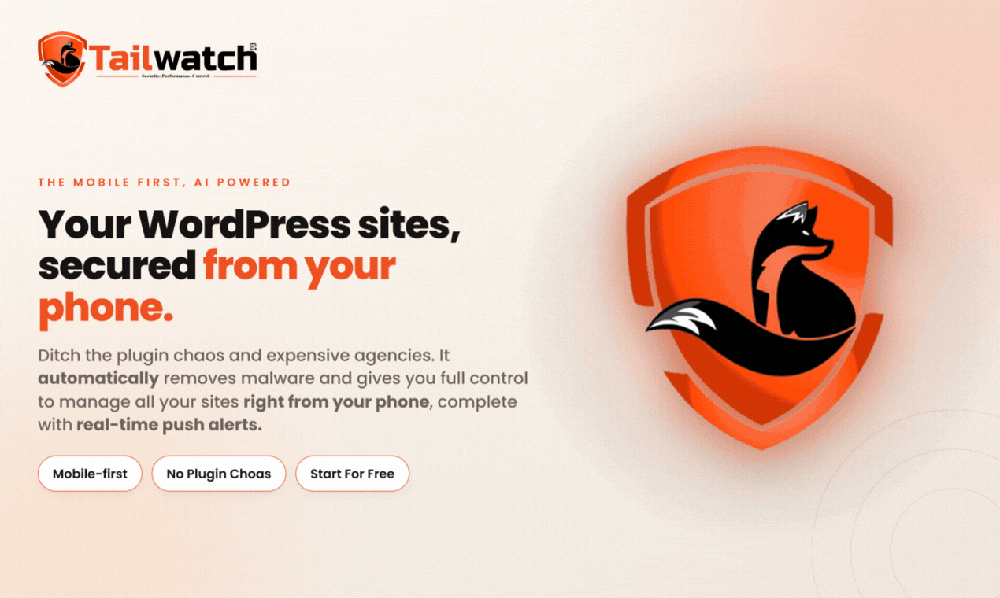

<p align="center">
  <a href="https://wptailwatch.com/?utm_source=github&utm_medium=readme&utm_campaign=free&utm_content=wptailwatch_logo"></a>
</p>

<p align="center">
  <a href="license.txt"></a>
  
  
  <a href="https://github.com/tailwatch/tailwatch/pulls"></a>
</p>

<p align=""><strong>WP Tailwatch is a free, open-source mobile-first WordPress security plugin, automated backup system, and real-time site monitoring tool. Built on a modular, performance-first architecture, it consolidates multiple of  single-purpose utilities—including security hardening audits, file change detection, file and database backups, activity logs, error tracking, DDoS and bot protection, disaster recovery, and migrations—into a single lightweight framework. Because it operates on an on-demand modular design, you only enable the specific features you need, ensuring maximum server performance without site deceleration. It functions as a complete website protection suite that eliminates the weight and cost of multiple premium plugin subscriptions.

Engineered with a decoupled, mobile-first hybrid architecture, administrators can seamlessly manage site security via a native `wp-admin dashboard`, a centralized headless `Cloud Dashboard` for multiple websites, or a secure companion `free mobile app`. 

Unlike traditional monolithic security plugins that leave you blind if a server goes offline or becomes compromised, WP Tailwatch prioritizes event-driven monitoring and secure off-site remote response. Safely bypass login lockouts, audit critical metrics, and deploy system-wide updates from anywhere. **Learn more at [wptailwatch.com](https://wptailwatch.com/?utm_source=github&utm_medium=readme&utm_campaign=free&utm_content=homepage_intro).**</strong></p>

### <p align="center"><a href="https://youtu.be/WVnD7oQNv2c?si=__oimi6qsvtBiVWe"><strong>▶️&nbsp; Watch the WP Tailwatch Overview Video</strong></a></p>

<br>

<p align="center">
  <a href="https://wptailwatch.com/?utm_source=github&utm_medium=readme&utm_campaign=free&utm_content=homepage_hero_banner"></a>
</p>

<br>

> 💡 **Developer-First & Reproducible:** This repository contains the **complete free plugin** — both the robust PHP runtime running in WordPress **and** the fully readable React source code for the admin dashboard. The shipped bundle is 100% reproducible from source (see [Build from source & development](#-build-from-source--development)).

---

## 🛠️ Active Development & Live Roadmap

The WP Tailwatch development team is actively maintaining, updating, and engineering this framework to stay ahead of emerging web vulnerabilities and build a premium-grade experience for the open-source community.

We update our features and security definitions transparently based on user feedback. Check out what we are currently working on and what modular features are coming up next on our live WP Tailwatch  **[Development Roadmap](https://wptailwatch.com/roadmap/?utm_source=github&utm_medium=readme&utm_campaign=free&utm_content=roadmap_features_section).**

---

## 📋 Core Features (Free Version)

Every feature listed here is **100% free and fully functional** — no trials, no locked buttons, no usage caps. Grouped the same way as our [features page](https://wptailwatch.com/features/?utm_source=github&utm_medium=readme&utm_campaign=free&utm_content=features_list).

### 🛡️ Protection — files & hardening
*Watch your files for tampering and close the hardening gaps attackers look for.*

- **File Integrity Watch** — Baselines all your site's files and flags anything added, changed, or deleted since the last scan.
- **Files & Permissions** — Blocks direct access to core directories and sensitive root files via `.htaccess`, disables the built-in file editor, and strips version/header disclosure.
- **Hardening Audit** — Checks your site against ~24 WordPress security best practices and flags issues with clear, prioritized recommendations.
- **Security Keys Rotation** — Rotates all WordPress salts and security keys in one click.

### 🔥 Firewall & access control
*Stop brute-force logins and control exactly who reaches your site.*

- **Login Defender** — Stops brute-force login attacks with IP lockouts, honeypot fields, and signup / lost-password controls.
- **IP Blocking** — Allow or block visitors by IP address or range, with a customizable block page.
- **Content Restrictions** — Deters casual content scraping by disabling right-click, copy, and inspect.

### 💾 Backup & recovery
*One-tap restores and safe updates that roll back if anything breaks.*

- **Backup Vault** — Full-site backups of your files and database.
- **SOS Recovery** 🆘 — Passwordless, one-tap recovery for locked-out administrators via the mobile app.
- **Updates & Rollback** — Update or roll back WordPress core, plugins, and themes safely.
- **Process Monitoring** — Detects and reschedules stalled WP-Cron background processes.

### 📊 Monitoring & logs
*See every change, error, and request across your site.*

- **Activity Logs** — A log of every login, failed attempt, registration, and password reset.
- **Error Logs** — Captures 4xx / 5xx HTTP errors (500s, 404s, 403s, rate-limits, and more) to catch broken pages and server errors.
- **Email / SMTP Logs** — Logs every outgoing WordPress email and supports custom SMTP servers.
- **Network Logs** — Records incoming API traffic — admin-ajax, REST API, cron, and XML-RPC — with response codes and timing.
- **Broken Links** — Scans your content and reports broken links.
- **Smart SSL** — Monitors your SSL certificate — expiry, TLS version, chain, and security grade — and alerts you before it expires.
- **Disk Space Monitoring** — Visual breakdown of your server disk and database usage.

### ⚙️ Management & utilities
*Everyday maintenance, right from your phone.*

- **Database Optimizer** — Cleans spam comments, trashed posts and comments, orphaned metadata, and expired transients to speed up your database.
- **User Management** — Create, edit, and delete WordPress users and change their roles.
- **Search & Replace** — Safe, serialization-aware database-wide search and replace.
- **Cron Job Scheduler** — View, manage, and reschedule WordPress cron jobs.
- **301 Redirection** — Create and manage clean 301 redirect rules.
- **Increase WP Limits** — Raise PHP memory, execution time, and upload-size limits.

### 📱 Companion app & alerts
*WP Tailwatch is mobile-first — keep an eye on your site from the free app (Android; iOS coming soon).*

- **Free companion app** — Check your site's security status, review recent activity, and act on alerts from your phone.
- **Event-based push notifications** — Real-time alerts for new logins, failed-login lockouts, HTTP errors, backup results, SSL expiry, and more.
- **Customizable alerts** — Get push notifications only for the features and events you choose — everything else stays silent.
- **One-tap secure auto-login** — Open your WP-Admin from the app with a single tap — no password to type.

📲 **[Get the free app on Google Play →](https://play.google.com/store/apps/details?id=com.wptailwatch)** (iOS coming soon)

> **⭐ Pro unlocks more:** AI Malware Guard (automatic malware detection & removal), Role-based 2FA, advanced User Management (password-less logins, inactive-user cleanup, user blocking), country-level geo-blocking, off-site cloud backup storage with one-click restore, Gmail OAuth for SMTP, and faster schedules / longer log retention. Explore everything at [wptailwatch.com/features](https://wptailwatch.com/features/?utm_source=github&utm_medium=readme&utm_campaign=free&utm_content=features_pro_unlock).

---

## 🚀 How to install WP Tailwatch Plugin

### Option 1: Manual installation from ZIP
1. Download the plugin ZIP file from our releases.
2. Go to your **WordPress Admin → Plugins → Add New → Upload Plugin**.
3. Choose the ZIP file, install, and click **Activate**.

### Option 2: Connect your account (Highly Recommended)
1. Register your free administrative account at [dashboard.wptailwatch.com](https://dashboard.wptailwatch.com/?utm_source=github&utm_medium=readme&utm_campaign=free&utm_content=dashboard_getting_started).
2. Navigate to the **WP Tailwatch** section inside your local WordPress administration panel.
3. Open the `Settings` page within the plugin interface and sync your site by clicking the Connect button.
4. Download and install the companion free mobile app from the [Google Play Store](https://play.google.com/store/apps/details?id=com.wptailwatch) and log in using your account credentials. (`iOS Coming Soon`)
5. All set! Your site is securely paired, and you will instantly begin receiving real-time push notifications on your phone.

***Note:** All core plugin security and site management features operate 100% locally within your own WordPress installation environment. Establishing a central cloud account authorization is strictly optional. It is only required if you choose to monitor and manage multiple websites from our centralized cloud dashboard at dashboard.wptailwatch.com, sync the companion free mobile application, route real-time push notifications, or execute secure off-site remote actions.*

 👉 [**Know your data privacy** ](#-security--privacy)

---

## 💻 Tech Stack & Security Profile

* **Core Requirements:**  WordPress 6.3+ · PHP 7.4+ (Fully optimized for PHP 8.1, 8.2, and 8.3 execution).
* **Decoupled Admin Frontend:** Modern Single Page Application (SPA) built natively using React 18, Redux Toolkit, and fully utility-styled via Tailwind CSS.
* **External Integrations:** Firebase Cloud Messaging (FCM) utilizing secure transit pipelines `(api.wptailwatch.com)` for instantaneous notification routing. MaxMind GeoLite2 integration for localized, database-driven IP geographic validation.  
* **Data Flow & Cloud Architecture:** 
  *  By default, operational metadata, threat indicators, and system logs are processed and stored locally inside your own database environment.  
  * When account integration is enabled, core metrics and real-time logs securely synchronize with our protected cloud infrastructure to power remote features, historical dashboard views, and mobile device actions.
* **Architecture Security Principles:** 
  * Cryptographically signed JWT authentication tokens for all localized and remote REST API endpoints.  
  * SHA-256 integrity check hashing for structural file audits.  
  * End-to-end encrypted transit pathways for all cloud data synchronization and mobile alerting pipelines.

 👉 [**Know your data privacy** ](#-security--privacy)

---

## 🔨 Build from Source & Development

WP Tailwatch is **100% open source** (GPLv2+). The React admin dashboard ships as a compiled bundle, built from the human-readable source in [`admin-app/`](admin-app/).

### Directory Architecture

```text
wp-content/plugins/tailwatch/
├── tailwatch.php                    # Plugin entrypoint
├── Admin/                           # PHP Controllers, Views, and REST endpoints
├── Vendor/                          # Composer dependencies
├── admin-app/                       # React Frontend Source (Create React App)
│   ├── src/                         # UI components, Redux slices, Hooks
│   └── package.json                 # Node dependencies for frontend
├── Admin/View/Static/               # Target compiled assets (JS/CSS/Media)
├── dev/                             # Local development helper tools
└── package.json                     # Root orchestration build scripts
```

> ⚙️ `admin-app/`, `scripts/`, `dev/`, and the root `package.json` are excluded from the distributed production ZIP to keep your WordPress installation extremely clean and lightweight.

### How it fits together

```
  admin-app/src/ ─(npm run build)─▶ admin-app/build/static/ ─(copy-build.js)─▶ Admin/View/Static/{js,css,media}
                                                                                               │
  Admin/View/Controller/InterfaceController.php renders <div id="root"> and enqueues           │
  everything it finds (glob) in Admin/View/Static/{js,css}. The React app (HashRouter) ◀───────┘
  mounts into #root and reads runtime data from the tailwatch_ajax object the PHP injects.
```


<details>
<summary><strong>🔧 Build & develop the dashboard</strong></summary>

<br/>

**Requirements:** Node.js 20+ and npm 10+. The React app compiles with `react-scripts` 5.0.1 (Webpack + Babel), which installs automatically — you don't add it yourself.

#### Production build

From the repository **root**:

```bash
npm run build
```

This runs `npm ci` inside `admin-app/`, compiles the React + Tailwind app to `admin-app/build/`, then runs `copy-build.js` to move the optimized assets into the PHP-served `Admin/View/Static/` directories (rewriting relative asset paths and preserving `custom.css`).

#### Local development

Install dependencies once, from the root:

```bash
npm install                  # root dev dependencies
npm ci --prefix admin-app    # React app dependencies
```

Then pick a workflow:

**A — Hot reload inside wp-admin (recommended).** Edit `admin-app/src/` and see changes live in your real WordPress dashboard, with full system context.

```bash
npm run dev:link      # copies dev/tailwatch-dev.php into wp-content/mu-plugins/
cp .env.example .env  # bridges localhost:3000 and your WordPress port
npm start
```

Open **WP Admin → WP Tailwatch** and edit components in `admin-app/src/`. Run `npm run dev:unlink` when finished to restore production asset routing.

**B — File watcher.** Rebuilds on every save — good for verifying the full Tailwind/CSS production pipeline.

```bash
npm run watch
```

**C — Instant WP Playground (no local WordPress needed).** Spins up an in-browser WebAssembly WordPress with WP Tailwatch pre-activated, for isolated prototyping and testing.

```bash
npm run dev:playground
```

#### Scripts

| Script | Purpose |
|--------|---------|
| `npm run build` | Full production compile, then copy into `Admin/View/Static/` |
| `npm run watch` | Rebuild + asset transfer on save |
| `npm start` | CRA development server |
| `npm run dev:link` / `dev:unlink` | Link / unlink the dev bridge in `mu-plugins/` |
| `npm run dev:playground` | Isolated WP Playground (WebAssembly) sandbox |

</details>

> **Dependencies & licenses:** every library bundled into the dashboard is permissive and GPL-compatible (MIT / ISC / Apache-2.0 / MPL-2.0) — no proprietary or non-commercial terms. Full third-party attribution ships with the compiled bundle in `Admin/View/Static/js/*.LICENSE.txt`, and the complete dependency list lives in [`admin-app/package.json`](admin-app/package.json).

---

## 🤝 Contributing & Community
We warmly welcome developer feedback, structural ideas, bug reports, and core framework enhancements!

- 🐛 **Spotted a Bug?** — Let us know by opening a descriptive, reproducible tracking log via a new GitHub Issue.

- 💡 **Feature Requests** — Have an architectural idea or suggestion to help shape our product roadmap? Email us directly at support@wptailwatch.com to share your feedback with our core engineering team.

- 🛠️ **Code Contributions** — Review open tracker assignments, fork the repository, and submit a cleanly formatted Pull Request directly to our contribute branch for testing rather than pushing directly to main.

- 🔒 **Vulnerability Disclosures** — Please do not open public issues or repository discussions for security exploits. Safely transmit sensitive discoveries directly to security@wptailwatch.com so we can coordinate a fast, patched production release.

---

## 🚀 Upgrade to WP Tailwatch Pro
Keep your WordPress sites fast by offloading heavy security scanning to our high-performance cloud infrastructure.

- 🛰️ **AI Malware Guard** — Automated off-site file & database scanning, cleaning, and restoration with zero server overhead.
- 🔐 **Advanced Access Control** — Role-based two-factor authentication (2FA) and country-level geo-blocking.
- 👥 **Advanced User Management** — Password-less logins, automatic inactive-user cleanup, and on-demand user blocking.
- 💾 **Cloud Backups & SMTP** — Off-site cloud backup storage with one-click restore, Gmail OAuth for SMTP, and faster schedules with longer log retention.
- 🏢 **Agency Exclusives** — Includes monthly Premium Support Credits for expert-led, manual hack cleanups by our core engineering team.

*More modules — firewall, traffic shield, site migrator, and more — are on the [development roadmap](https://wptailwatch.com/roadmap/?utm_source=github&utm_medium=readme&utm_campaign=free&utm_content=roadmap_pro_section).*

👉 **[View Plans →](https://wptailwatch.com/pricing/?utm_source=github&utm_medium=readme&utm_campaign=pro_upgrade&utm_content=pricing_table_button)**

---

## 🔒 Security & Privacy
***Note:** All core plugin security and site management features operate 100% locally within your own WordPress installation environment. Establishing a central cloud account authorization is strictly optional. It is only required if you choose to monitor and manage one or multiple websites from our centralized cloud dashboard at [dashboard.wptailwatch.com](https://dashboard.wptailwatch.com/?utm_source=github&utm_medium=readme&utm_campaign=free&utm_content=dashboard_privacy_note), sync the companion free mobile application, route real-time push notifications, or execute secure off-site remote actions. Connecting your account securely bridges operational data, real-time activity logs, and system metrics to our protected cloud infrastructure.*


👉 Please check the website policy pages  →  **[Privacy Policy](https://wptailwatch.com/privacy-policy/?utm_source=github&utm_medium=readme&utm_campaign=free&utm_content=privacy_policy)** · **[Terms of Service](https://wptailwatch.com/terms-of-services/?utm_source=github&utm_medium=readme&utm_campaign=free&utm_content=terms_of_services)**

---

## 🔗 Links

- **Website:** [wptailwatch.com](https://wptailwatch.com/?utm_source=github&utm_medium=readme&utm_campaign=free&utm_content=footer_website)
- **Dashboard:** [dashboard.wptailwatch.com](https://dashboard.wptailwatch.com/?utm_source=github&utm_medium=readme&utm_campaign=free&utm_content=footer_dashboard)
- **Android App:** [Get it on Google Play](https://play.google.com/store/apps/details?id=com.wptailwatch)
- **Blog:** [wptailwatch.com/blog](https://wptailwatch.com/blog/?utm_source=github&utm_medium=readme&utm_campaign=free&utm_content=blog)
- **Roadmap:** [wptailwatch.com/roadmap](https://wptailwatch.com/roadmap/?utm_source=github&utm_medium=readme&utm_campaign=free&utm_content=footer_roadmap)
- **Contact:** [wptailwatch.com/contact](https://wptailwatch.com/contact/?utm_source=github&utm_medium=readme&utm_campaign=free&utm_content=contact)

---
## 📜 License
See [`license.txt`](license.txt).
---

<p align="center"><strong>Built for WordPress Security & Site management on the GO.</strong></p>